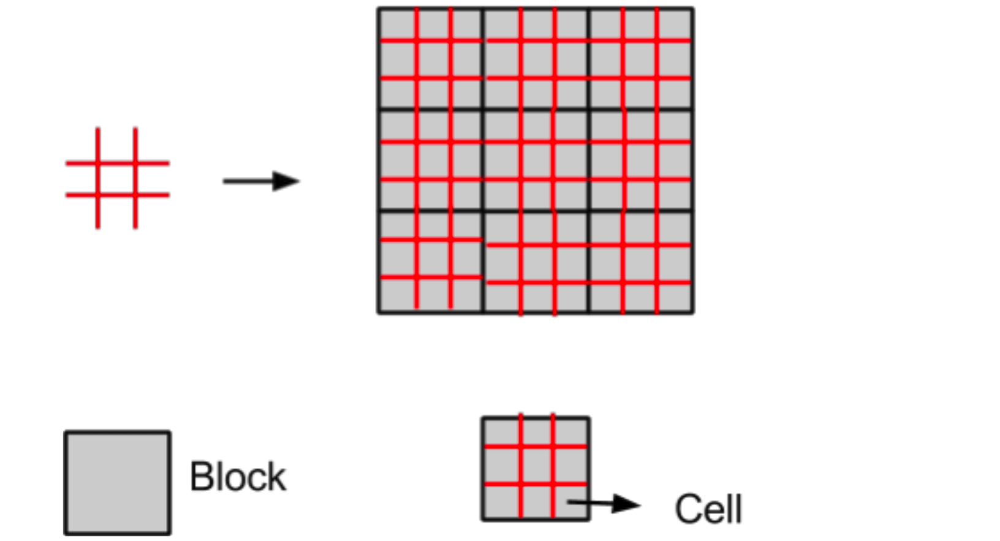

## Ultimate Tic-Tac-Toe ##

### Objective ###
**To implement a ‘Ultimate TicTacToe’ game playing agent.**  

- Ultimate TicTacToe is an extension of the 3x3 TicTacToe, where there are 9 blocks each having 3x3 cells.
- The marker for the first player is **‘X’** and for the second player is **‘O’**.
- The objective of the game is to win the board by making a legitimate pattern of the blocks.  

#### To be played by three different modes ####
1. Random_Player1 v/s Random_Player2
2. Random_Player v/s Human
3. Human1 v/s Human2

#### Language ####
- Python with (random, copy, sys and signal libraries imported).

### Game Rules ###
- **[FIRST MOVE]** The very first move of the game is an open move, i.e. Any cell on the entire board is valid.
- **[CORRESPONDENCE RULE]** If the opponent places his/her marker in any of the cells, except for the center
cell of a block, then you need to place your marker anywhere in the two blocks adjacent to the block
corresponding to the cell. For example, for the top left cell, the next player needs to move in center left and
top center. Similarly for the right center cell, top right and bottom right blocks are open. Please refer to the
code for more clarity.
- **[CENTER RULE]** If the opponent places his/her marker in the center cell of any block, then you need to place
your marker in the center block only. Please refer to the below figure.
- **[FREE MOVE RULE]** In case the all of the cells in the destined blocks obtained from Rule 2 or Rule 3 are
occupied, then the player may move in any free cell in the entire board.
- **[ABANDON RULE]** Once a block is won by a player, it has to be abandoned. That is, you may consider the
entire block to be full and no other player may play in that block.
- **[WIN RULE]** The player who wins any three blocks which are either a row, column or diagonal of the board,
wins the game and the game is over. If all the cells are filled, and no pattern has been formed then the game is
over.  

  
#### Time Limit  

- You need to return a valid move from your move function within 12 seconds(when playing against Random_Player). If the time exceeds 12 seconds for a particular move, then the match will be forfeited and the opponent will win by default.  

------------------------------------------------------
#### How to run game ###
- keep the evaluator and the player code in the same diresctory.
- run `python evaluator_code.py x` on your terminal(assuming you on linux, else search for running python file in your system.)
- provide `x` as `1/2/3` as pet the mode yoy want to play.
1 for both player are bot
2 for 1 player is bot and other one is human
3 both are human 

## Try and Beat my bot ;) ##
